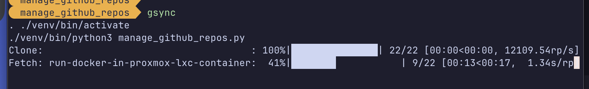
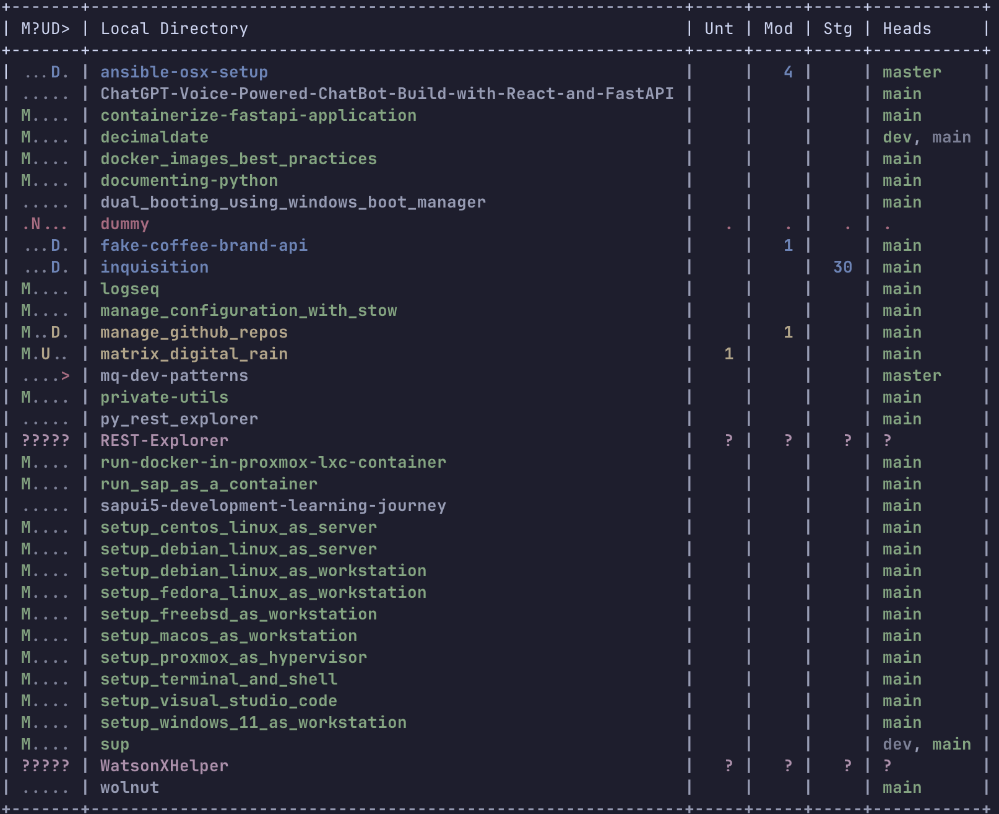
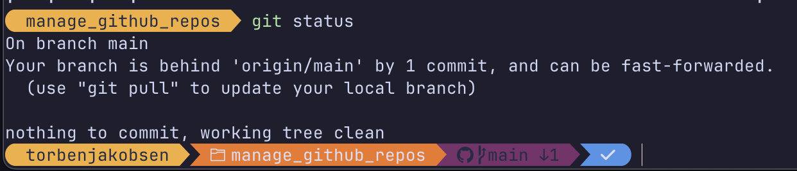

.. _Homebrew: https://brew.sh/
.. _Ben Du: https://misc.legendu.net/blog/hands-on-GitPython/
.. _readthedocs tutorial: https://gitpython.readthedocs.io/en/stable/tutorial.html

##############################
  Manage GitHub Repositories
##############################

A simple utililty to keep GitHub repositories syncronized.

.. note::

  It is assumed GitHub is used, but any git repository is expected to work
  as long as you can access it (permissions and connectivity).

| I use macOS and Linux daily (not so much Windows).  
| I have created some shell aliases to support the script.
| For macOS/linux there is a ``Makefile`` to handle setting up, building and running the application.
| 

If you are a Windows user, the script also works and will be described as well.

**********************
  Overview / Install
**********************

Requirements
============

The one actual requirement is python and the package ``GitPython``;
the rest of the Python packages are for convenience and cosmetics like colors and progress bars.
I like a progress bar but it does mean some of the methods expects and updates a progress bar as a sideeffect.

Feel free to omit the progress bar by modifying the script if you like - 
for example to be used by another script. 

The optional ``Makefile`` depends on the presence of the command ``make``.

The ``GitPython`` package wraps an installed ``git`` thus ``git`` is a dependency.

macOS
-----

You can get ``git`` and ``make`` by installing the Xcode command line tools.

Open a terminal and write:

.. code:: bash
  
  xcode-select --install

Accept the terms to install.

Optionally verify:

.. code:: bash

  xcode-select -p

You can see all the installed tools at: ``/Library/Developer/CommandLineTools/usr/bin``.

If you for example use ``git`` in macOS, and ``git`` is not installed,
you will be offered to install by the operating system,
which will do what the install command above does.

The Xcode CLI tools will update jointly with the regular OS updates and core applications like Safari.

You can choose the use Homebrew_ if you want the latest versions or don't want the Apple adapted/modified versions.

Windows
-------

...

Linux
-----

.. code:: bash

  # untested
  sudo apt install -y gcc git

How to run
==========

Configuration file
------------------

| The script needs a configuration file: ``repos.csv``.
| In the project there is an ``example.csv`` file you can copy and modify.
| 

.. code:: text

  # Example CSV repository file
  # Comments, blanks, and blank lines are allowed
  # Copy this file to `repos.csv`
  # For public you can use https; for private use git and tokens
  # Note that using https protocol will only work for fetching.

  decimaldate,                       git@github.com/TorbenJakobsen/decimaldate
  manage_configuration_with_stow,    git@github.com/TorbenJakobsen/manage_configuration_with_stow
  manage_github_repos,               git@github.com:TorbenJakobsen/manage_github_repos
  matrix_digital_rain,               git@github.com/TorbenJakobsen/matrix_digital_rain
  setup_fedora_linux_as_workstation, git@github.com/TorbenJakobsen/setup_fedora_linux_as_workstation
  
  setup_terminal_and_shell,          https://github.com/TorbenJakobsen/setup_terminal_and_shell

My preference is to make a symbolic link to a repository where my private/personal files are kept 
(no keys, tokens or account details).
As the script manages all repositories in the parent directory (from this repository)
one simply makes initial fetches so *this* repository and ``../private-utils`` are present
before make the symbolic link.

.. code:: bash

  ln -sf ../private-utils/repos.csv ./repos.csv

If you make changes to the linked ``repos.csv`` make sure to
stage and push the change in ``private-utils/repos.csv``.

macOS /Linux
------------

The following is added to my ``~/.zshenv`` file:

.. code:: bash
  
  export REPOS="~/source/repos"
  alias repos="cd $REPOS"
  alias grepos="cd $REPOS/GitHub"
  alias gsync="grepos;cd manage_github_repos;make run"

So write ``gsync`` in a terminal. 
You will stay in the ``manage_github_repos`` directory.

The meaning of colors ... TODO

Oh-my-posh
----------

A repository that is syncronized with the remote will look like this:

*************
  Resources
*************

- `readthedocs tutorial`_
- `Ben Du`_ has a list with examples.
